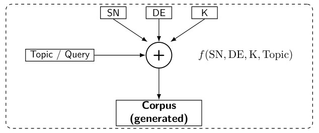

# <br>
# **<u>NarrEmGen: Narrative Generation Pipeline (CLI & GUI)</u>**<br>
- **<u>Implementing Partially The SN/DE/K Method For a Controlled Generation</u>**<br>
- **<u>Artificial structured advice micro-texts from narrative, emotional, context</u>**<br>
- **<u>Suitable for education & learning, or comparing and training the llm output</u>**<br>
- **<u>Writing in file Full Booklets of Advice or Answers from a Topic or Question</u>**<br>

<br>

<br>

## Main modules of narremgen <br>

- `pipeline`: Entry point for batch generation, variants, stats, and exports per topic run.
- `llmcore`: Unified LLM router (role→model mapping, retries, multi-provider support).
- `data`: Input preparation and CSV handling for topic–advice–prompt-based generation.
- `narratives`: Text post-processing, style control, and SN/DE-aware narrative realization.
- `variants`: Planning and batch rewriting into alternative styles (direct, formal, etc.) with stats.
- `themes`: LLM-based theme discovery and assignment for advice corpora, producing themes+assignments.
- `chapters`: Build chaptered corpora (CSV/JSON) from themes or manual grouping, for book-like exports.
- `export`: Plain-text and LaTeX exporters (merged `.txt` and `book_*.tex` from neutral and variants).
- `analyzestats`: Length, lexical, emotion and SN/DE distribution analysis, with CSV summaries and plots.
- `utils`: Shared helpers for workdirs, filenames, CSV repair, backups, and neutral corpus construction.
- `gui`: Optional Tkinter GUI for generation, or readings aligned/selected texts, or segmentation.
- `main`: Optional command-line terminal module for the generation with input arguments.

    
## Key features

- Generation of a <u>Corpus</u> of <u>Stories</u> (of varying and controlled structures) and <u>Formal Texts</u> for advice from a topic (full sentence).
- Multi-batch narrative pipeline using a configurable LLM router (`llmcore`) across several providers with a command-line interface.
- Automatic topic and advice mapping, SN/DE-structured neutral generation, and aligned variant rewriting (direct, formal, other styles).
- Robust CSV workflow: filtering, renumbering, safe merging of advice/sentence/context/mapping, consistent filenames, variant workdirs.
- LLM-driven theme extraction and assignment, plus chapter construction for organizing texts into coherent sections (classes of texts).
- Plain-text and TeX export of neutral and variant corpora (merged narrative files and full chaptered books for text reading/selection).
- Integrated corpus analysis: lexical richness, length, emotion profiles, and SN/DE distributions, including neutral vs. variant comparison.
- Textual statistics and emotion statistics of specialized language models from the literature for evaluation of generated texts or corpus.
- Ready-to-use structure for reproducible experiments in text generation with emotions for character and educational content synthesis.
- Graphical user interface for generation with api key checkings, creation of variants, and reading/selection of aligned textes for a topic.
- Available connection to OpenAI, OpenRouter, Google-GenAI, Mistral, etc for text generation (see python code and interface for dry-run).
- No limited length for topic str, available command for adding file/str long text as context for advice or generation stages in pipeline.

Note: This package is provided *“as is”* for the research and educational purposes.  <br>
      The code was written/debogged in iterative way with help of gpt5 openai + vs code. <br>
      All texts generated are synthetic and intended for future experimentations only. <br>
      Last version in directory package for pypi. 

To do: improve genericity, generality and robutness, add parallelism, classes re-factor.

## Usage

```
pip install narremgen
```

```python
import narremgen
from narremgen import pipeline

run_pipeline(
    topic="Walking_in_the_city",
    output_dir="./outputs",
    assets_dir="./narremgen/settings",
    n_batches=2,
    n_per_batch=20,
    output_format="txt",
    verbose=False
)
```

With command lines in the terminal: Generation <br>

```python
# Pipeline + variants (default, not user ones)
python -m narremgen.main \
  --topic "Walking_in_the_city" \
  --output-dir "./outputs" \
  --batches 2 \
  --per-batch 20 \
  --output-format txt \
  --verbose
```

```python
# Pipeline without variants (neutral only)
python -m narremgen.main \
  --topic "Walking_in_the_city" \
  --output-dir "./outputs" \
  --batches 2 \
  --per-batch 20 \
  --output-format txt \
  --skip-variants \
  --verbose
```

```python
# Dry-test without generation pipeline
python -m narremgen.main \
  --diagnostic-dry-run \
  --verbose
```

With command lines in the terminal: GUI <br>

```python
# Interface generation+reading+saving
python -m narremgen.gui
```

Each generated corpus is stored under `outputs/` in CSV and TXT format.  
The naming convention is: `outputs/<corpus_name>_1/` for its directory.<br>
Each directory contains:
```
topic, advice, and mapping tables in csv format and generated texts
and two subdirectories containing generated batched texts + csv files
plus directories for variants with statistics + chaptered tex files
```

## Other example of call (check model names in documentations)

OpenAI everywhere as simple default + export TeX booklet  
`narremgen --topic "Small habits, big effects" --output-dir "./out" --default-model "openai\gpt-4o-mini" --export-book-tex`

Ollama local (offline) + TeX output + skip theme analysis  
`narremgen --topic "Home organisation and walking" --output-dir "./out" --default-model "ollama\gemma3:4b" --batches 3 --per-batch 30 --output-format tex --export-book-tex`

OpenRouter mix: DeepSeek for mapping, Llama for narrative, GPT-4o-mini for the rest + multiple variants  
`narremgen --topic "Walk habits in the city" --output-dir "./out" --api-key-file "./llmkeys.txt" --model-advice "openrouter\openai/gpt-4o-mini" --model-mapping "openrouter\deepseek/deepseek-reasoner" --model-context "openrouter\openai/gpt-4o-mini" --model-narrative "openrouter\meta-llama/llama-3.1-70b-instruct" --model-variants-generation "openrouter\openai/gpt-4o-mini"`

Mistral direct (OpenAI-compatible) + themes enabled with custom range and batch size  
`narremgen --topic "Healthy routines for a walk everyday" --output-dir "./out" --api-key-file "./llmkeys.txt" --default-model "mistral\mistral-large-latest" --themes-min 7 --themes-max 12 --themes-batch-size 30`

Grok default + bypass variants generation to local Phi-4 (Ollama) with larger token budget  
`narremgen --topic "Walking around in a small town" --output-dir "./out" --api-key-file "./llmkeys.txt" --default-model "grok\grok-2-latest" --model-variants-generation "ollama\phi4:14b" --variant-batch-size 40 --variant-max-tokens 2500`

Quick connectivity check (no files generated): diagnostic dry-run with longer timeout  
`narremgen --diagnostic-dry-run --model-advice "openrouter\deepseek/deepseek-chat" --request-timeout 90`

## Warning

Only informed users or trainers should use this system in practice. <br>
Some advice may be missing or mistaken du to ia/programming. <br>
In future automatic checkings may be implemented for end user.

## References

- Rodolphe Priam (2025). *Narrative and Emotional Structures For Generation Of Short Texts For Advice*, [hal-05135171](https://inria.hal.science/hal-05135171), 2025.

---

© NarrEmGen Project, 2025-2026.
     
