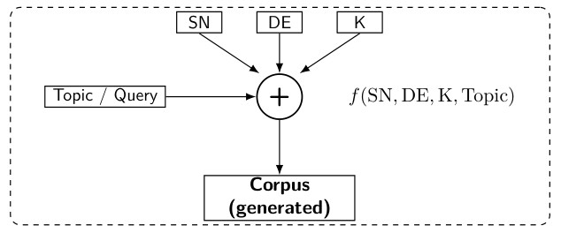
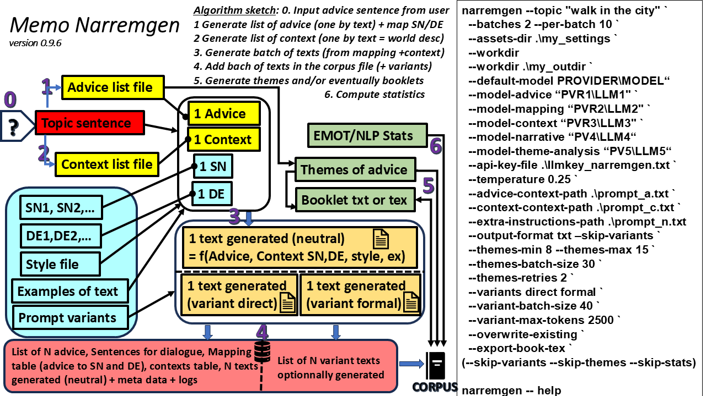
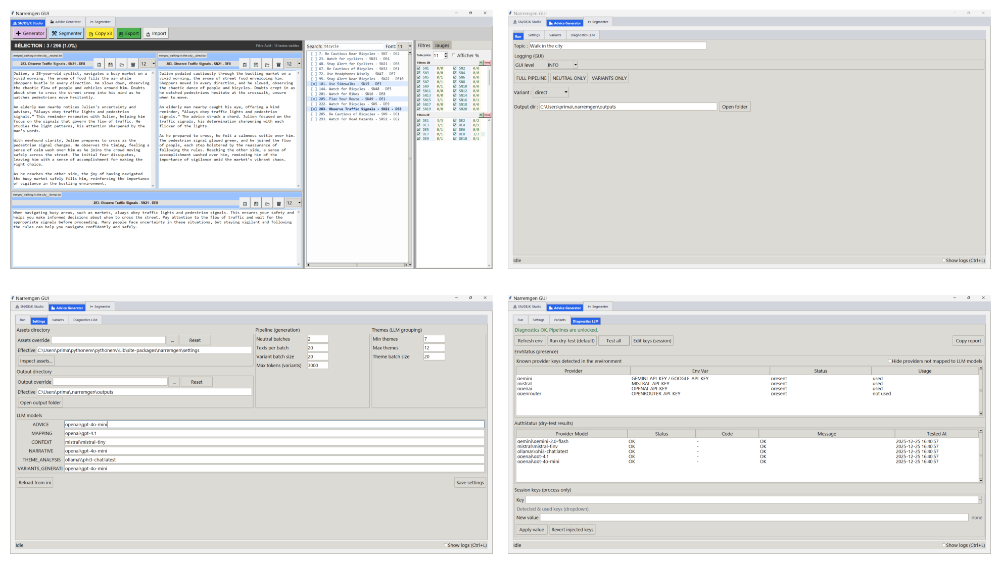

# <br>
# **<u>NarrEmGen: Narrative Generation Pipeline (CLI & GUI)</u>**<br>
- **<u>Implementing Partially The SN/DE/K Method For a Controlled Generation</u>**<br>
- **<u>Artificial structured advice micro-texts from narrative, emotional, context</u>**<br>
- **<u>Writing in file Full Booklets of Advice or Answers from a Topic or Question</u>**<br>
- **<u>Suitable for education & learning, or comparing and training the llm output</u>**<br>
- **<u>Process data with five different llm calls from key in file or in environment</u>**<br>
- **<u>Available: command lines, graphical user interface, or python programming</u>**<br>

<br><br>

## Main modules of narremgen <br>

- `pipeline`: Entry point for batch generation, variants, stats, and exports per topic run.
- `llmcore`: Unified LLM router (role→model mapping, retries, multi-provider support).
- `data`: Input preparation and CSV handling for topic–advice–prompt-based generation.
- `narratives`: Text post-processing, style control, and SN/DE-aware narrative realization.
- `variants`: Planning and batch rewriting into alternative styles (direct, formal, etc.) with stats.
- `themes`: LLM-based theme discovery and assignment for advice corpora, producing themes+assignments.
- `chapters`: Build chaptered corpora (CSV/JSON) from themes or manual grouping, for book-like exports.
- `export`: Plain-text and LaTeX exporters (merged `.txt` and `book_*.tex` from neutral and variants).
- `analyzestats`: Length, lexical, emotion and SN/DE distribution analysis, with CSV summaries and plots.
- `utils`: Shared helpers for workdirs, filenames, CSV repair, backups, and neutral corpus construction.
- `gui`: Optional Tkinter GUI for generation, or readings aligned/selected texts, or segmentation.
- `main`: Optional command-line terminal module for the generation with input arguments.

<br><br>

## Key features

- Generation of a <u>Corpus</u> of <u>Stories</u> (of varying and controlled structures) and <u>Formal Texts</u> for advice from a topic (full sentence).
- Multi-batch narrative pipeline using a configurable LLM router (`llmcore`) across several providers with a command-line interface.
- Automatic topic and advice mapping, SN/DE-structured neutral generation, and aligned variant rewriting (direct, formal, other styles).
- Robust CSV workflow: filtering, renumbering, safe merging of advice/sentence/context/mapping, consistent filenames, variant workdirs.
- LLM-driven theme extraction and assignment, plus chapter construction for organizing texts into coherent sections (classes of texts).
- Plain-text and TeX export of neutral and variant corpora (merged narrative files and full chaptered books for text reading/selection).
- Integrated corpus analysis: lexical richness, length, emotion profiles, and SN/DE distributions, including neutral vs. variant comparison.
- Textual statistics and emotion statistics of specialized language models from the literature for evaluation of generated texts or corpus.
- Ready-to-use structure for reproducible experiments in text generation with emotions for character and educational content synthesis.
- Graphical user interface for generation with api key checkings, creation of variants, and reading/selection of aligned textes for a topic.
- Available connection to OpenAI, OpenRouter, Google-GenAI, Mistral, etc for text generation (see python code and interface for dry-run).
- No limited length for topic str, available command for adding file/str long text as context for advice or generation stages in pipeline.
- Input in the pipeline a list of pre-written advice with a csv table path with col name Advice, or prefer a dedup automatically generated.

Output: Each generated corpus is stored under `outputs/` in CSV and TXT format. <br> 
The naming convention is: `outputs/<corpus_name>_1/` for its directory.<br>
Each directory contains:
```
topic, advice, and mapping tables in csv format and generated texts
and two subdirectories containing generated batched texts + csv files
plus directories for variants with statistics + chaptered tex files
```

Note: This package is provided *“as is”* for the research and educational purposes.  <br>
      The code was written/debogged in iterative way with help of gpt5 openai + vs code. <br>
      All texts generated are synthetic and intended for future experimentations only. <br>
      Last version in directory package for pypi. 

To do: improve genericity, generality and robutness, add parallelism, classes re-factor.

## Installation

```
pip install narremgen
```

## Ask for help and the first examples in the cli

```
narremgen --help
```

## Usage from cli, examples of command lines

OpenAI gpt4o as the default model (use also sys env key OPENAI_API_KEY instead of txt file) + export TeX booklet

`
narremgen --topic "Small walks, big effects" --default-model "openai\gpt-4o-mini" --export-book-tex
`

OpenRouter for  DeepSeek for mapping, Llama for narrative, GPT-4o-mini for the rest + multiple variants  

`
narremgen --topic "Walk habits in the city" --model-advice "openrouter\openai/gpt-4o-mini" --model-mapping "openrouter\deepseek/deepseek-r1" --model-context "openrouter\openai/gpt-4o-mini" --model-narrative "openrouter\meta-llama/llama-3.1-70b-instruct" --model-variants-generation "openrouter\openai/gpt-4o-mini"
`

Mistral direct (OpenAI-compatible api, use sys env key) + themes enabled with custom range and batch size  

`
narremgen --topic "Healthy routines for a walk everyday" --default-model "mistral\mistral-large-latest" --themes-min 1 --themes-max 15 --themes-batch-size 30
`

Grok default (use sys env key) + bypass variants generation to local Phi-4 (Ollama) with larger token budget  

`
narremgen --topic "Walking around in a small town" --default-model "xai\grok-2-latest" --model-variants-generation "ollama\phi4:14b" --variant-batch-size 40 --variant-max-tokens 2500
`

Quick connectivity check (no files generated): diagnostic dry-run with longer timeout to check which models are available

`
narremgen --diagnostic-dry-run --request-timeout 90 --model-theme-analysis "ollama\\phi3-chat:latest" --model-advice "ollama\\phi3-chat:latest" --model-mapping "ollama\\phi3-chat:latest" --model-context "ollama\\phi3-chat:latest" --model-narrative "google\\gemini-2.0-flash"
`

## With command lines in the terminal (use narremgen or python -m narremgen.main) <br>

Example of equivalent call to narremgen

`
python -m narremgen.main --topic "Walking_in_the_city" --batches 1 --per-batch 15 --output-format txt --skip-variants --verbose --default-model "openai\gpt-4o-mini" --skip-themes
`

Dry-test without generation pipeline with mandatory model(s) entry

`
python -m narremgen.main --diagnostic-dry-run --verbose --default-model "ollama\\phi3-chat:latest"
`
`
narremgen --diagnostic-dry-run --verbose --default-model "ollama\\phi3-chat:latest" --model-advice "ollama\\phi3-chat:latest" --model-mapping "openai\\gpt-4o" --model-context "ollama\\phi3-chat:latest" --model-narrative "gemini\\gemini-2.0-flash" --model-variants-generation "openai\\gpt-4o-mini"
`

## Launch call for GUI <br>

```python
# Interface generation+reading+saving
python -m narremgen.gui
```

<br><br>

## Custom calls with python programming for pipeline

```python
from importlib.resources import files
from narremgen import LLMConnect, run_pipeline
LLMConnect.init_global(default_model="openai/gpt-4o-mini")
assets_dir = str(files("narremgen").joinpath("settings"))
run_pipeline(
    topic="Walking in the city",
    workdir="./outputs",
    assets_dir=assets_dir,
    n_batches=2,
    n_per_batch=20,
    output_format="txt",
    verbose=False,
)
```

## Example of calls with python code for llmcore (free or charged tokens from providers)

| Provider | Required env variables or key file | Model example (`provider\\model`) |
|---|---|---|
| OpenAI | `OPENAI_API_KEY` | `openai\\gpt-4o-mini` |
| Mistral | `MISTRAL_API_KEY` | `mistral\\mistral-small-latest` | 
| xAI / Grok | `XAI_API_KEY` or `GROK_API_KEY` | `xai\\grok-2-mini` | 
| Gemini/Google | `GEMINI_API_KEY` or `GOOGLE_API_KEY` | `gemini\\gemini-2.0-flash` | 
| Ollama (local) | `OLLAMA_HOST` (optional) | `ollama\\llama3.2:3b` | 
| OpenRouter | `OPENROUTER_API_KEY` | `openrouter\\anthropic/claude-3.5-sonnet` | 

```python
from narremgen.llmcore import LLMConnect

llm = LLMConnect(
    default_model="ollama\\phi3-chat:latest",
    max_tokens=400,
    request_timeout=60,
)

messages = [
    {"role": "system", "content": "Answer concisely."},
    {"role": "user", "content": "Write 3 advice for walking in a city, 1 sentence each."},
]

reply = llm.safe_chat_completion(model="gemini\\gemini-2.0-flash", messages=messages)
print(reply)
```


## Warning

- Only informed users or trainers should use this system in practice. 
- Some advice may be missing or mistaken du to ia/programming. 
- In future automatic checkings may be implemented for end user. 
- Always do a dry-run before launching to check models in use. 

## References

- Rodolphe Priam (2025). *Narrative and Emotional Structures For Generation Of Short Texts For Advice*, [hal-05135171](https://inria.hal.science/hal-05135171), 2025.

---

© NarrEmGen Project, 2025-2026.
     
